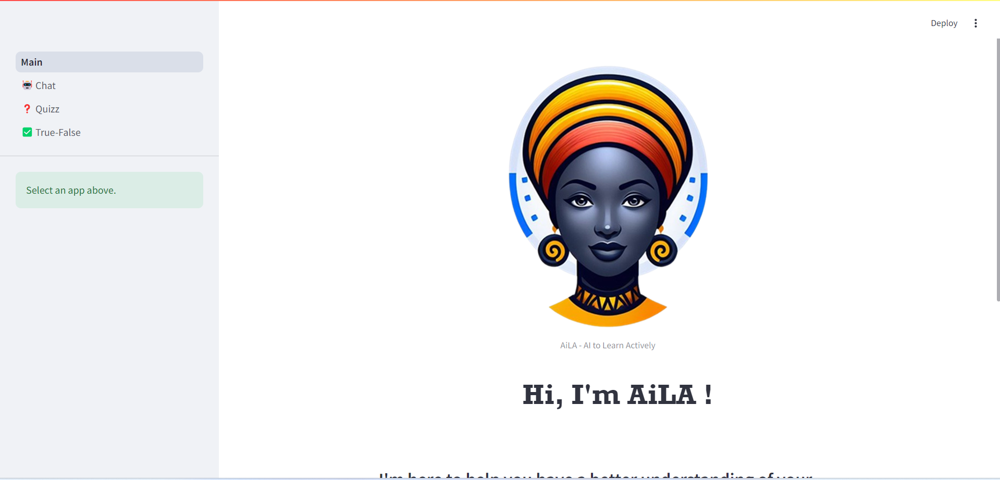

# AiLA - AI to Learn Actively

### Streamlit app powered by Gemini-1.5-Flash for:
1. RAG Chat
2. Quiz Generation
3. True/False Question Génération .

---

[Hosted AiLA App](https://aila-chat.streamlit.app)  

---

To run the app locally:

- git clone it
- Create file `.streamlit/secrets.toml`
- Add the line `GOOGLE_API_KEY = "xxxxx-your-api-key-xxxxx"`
- `pip install -r requirements.txt`
- Install tesseract-ocr and poppler-utils 
    - Ubuntu: `sudo xargs -a packages.txt apt-get install -y`
    - Windows : 
        - poppler : [here](https://github.com/oschwartz10612/poppler-windows/releases/latest)
        - tesseract: [here](https://github.com/UB-Mannheim/tesseract/wiki)
- `streamlit run Main.py`
